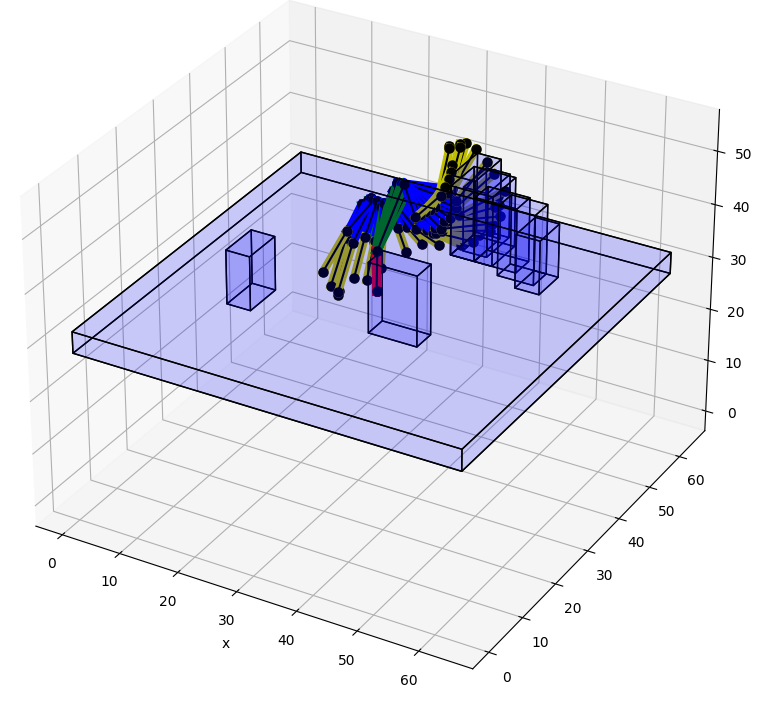

# c2g-HOF

This repository provides the source code, trained model and instructions for using c2g-HOF network. The c2g-HOF networks learns to generate cost-to-go functions for planning the motion strategies for a 7 Degrees of Freedom (DOF) manipulators. The c2g-HOF architecture consists of a cost-to-go function over the configuration space represented as a neural network (c2g-network as well as a Higher Order Function (HOF) network  which outputs the weights of the c2g-network for a given input workspace. Both networks are trained end-to-end in a supervised fashion using costs computed from traditional motion planners. Once trained, c2g-HOF can generate a smooth and continuous cost-to-go function directly from workspace sensor inputs (represented as a point cloud in 3D). At inference time, the weights of the c2g-network are computed very efficiently and near-optimal trajectories are generated by simply following the gradient of the cost-to-go function. 
# Install dependencies
    pip install -r requirements.txt
# Dataset
You can download a sample dataset for training and trained model for the demo.
    https://drive.google.com/drive/folders/14wek1OF2Xk4WFbcO93XUWf2iL7FTdEJv?usp=drive_link

# Training
    python -m seven_dof_c2g.run --env_name ws_7d_prm_var_test --device cuda:0 --visdom_port 8008 --lr 0.00003
### Visdom (online visualization tool for training curve)
    visdom -port 8008  

You can connect the visdom with the address http://localhost:8008/ on your web browser.

# Demo
We provide a planning example (demo_data/demo_plan/example_planning.pickle) with a trained c2g-HOF model (seven_dof_c2g/runs/ws_7d_prm_var_c2g_diag_rbf_0005). You can see the planning demo on this data by running:

    python demo.py

# Citation
@article{huh2020cost,  
  title={Cost-to-Go Function Generating Networks for High Dimensional Motion Planning},  
  author={Huh, Jinwook and Isler, Volkan and Lee, Daniel D},  
  journal={arXiv preprint arXiv:2012.06023},  
  year={2020}  
}
